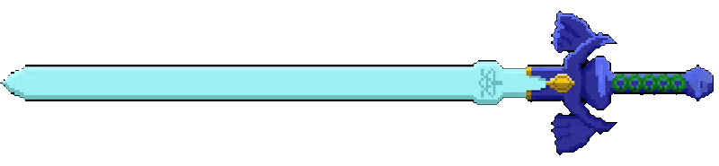
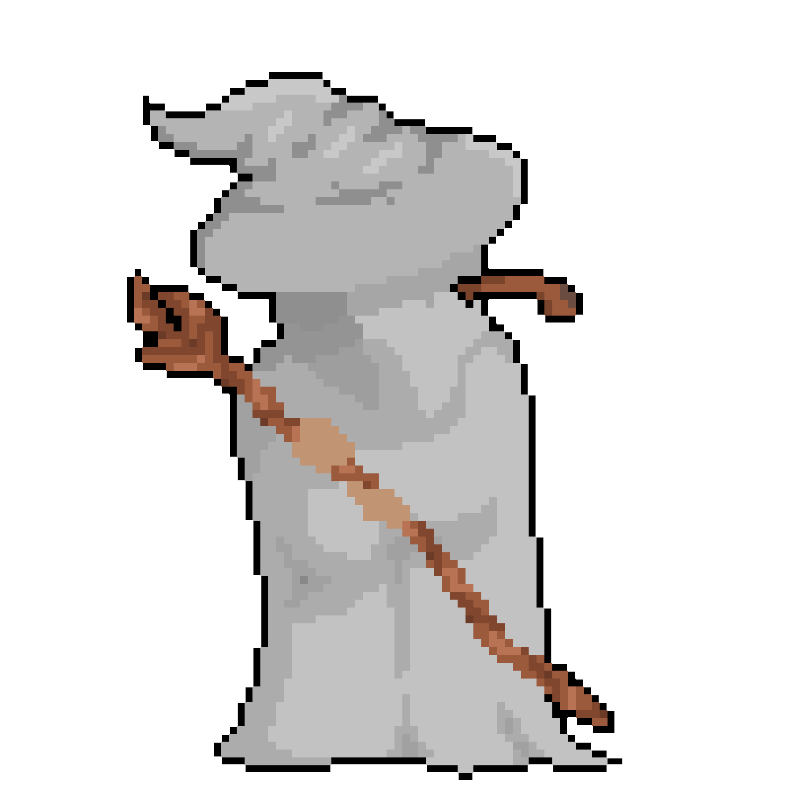
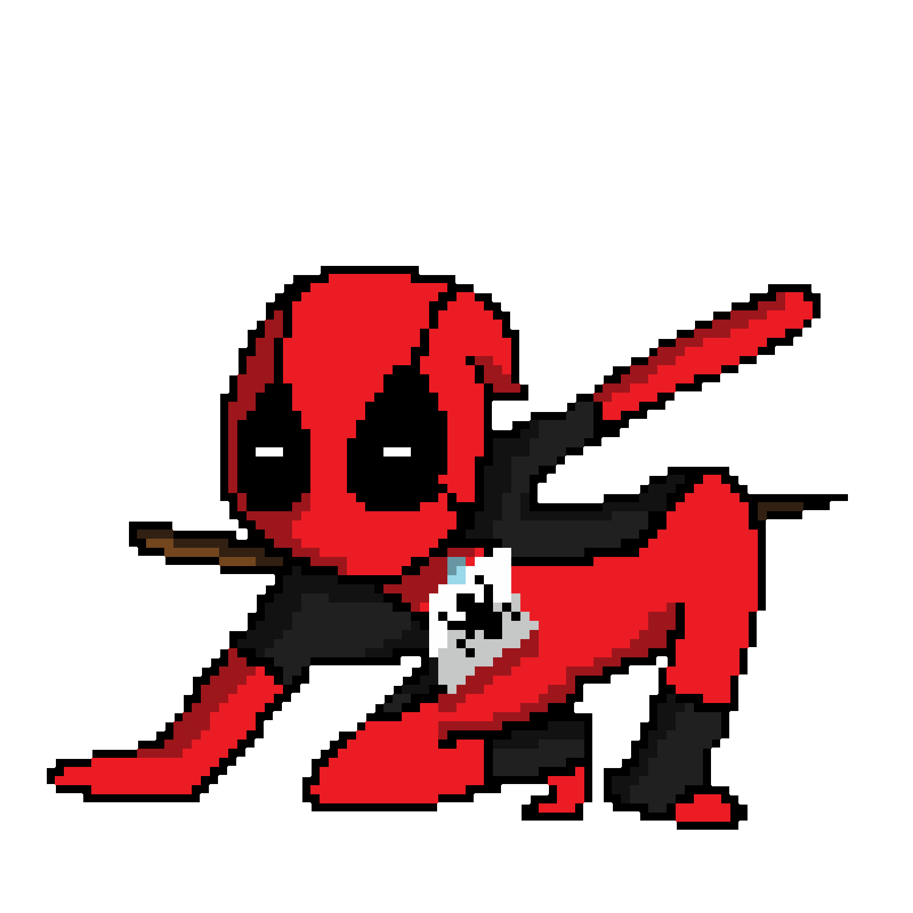

  
 

<h3 align="center" font=Outfit>
• Fullstack •
</h3>

---

> Computer Scientist focused on building digital products that connect design, usability and scalable development.
> 
>
> "_Computing is not about computers any more. It is about living_" -
> Nicholas Negroponte

---

<table>
<tr>

<td align="center" width="25%" font=Outfit>

## Product Design  

**Strategy**  
**Research**  
**Problem Solving**

Creating digital products  
focused on value, usability  
and business impact. 

</td>

<td align="center" width="25%">

## UX/UI 

**User Experience**  
**Interface Design**  
**Accessibility**

Designing intuitive and  
consistent interfaces that  
deliver better experiences.

</td>

<td align="center" width="25%">

## Frontend 

**React**  
**JavaScript**  
**Responsive Design**

Building modern interfaces  
with performance and visual consistency.

</td>

<td align="center" width="25%">

## Backend 

**APIs**  
**Logic**  
**Architecture**

Developing scalable  
solutions and structured  
system integrations.

</td>

</tr>
</table>

---

 

| • | • | • | • |
|:---:|:---:|:---:|:---:|
| React | Node.js | Figma | Git |
| JavaScript | Python | UX/UI | Node |
| Next | APIs | Product Design | Vue.js |
| Tailwind | Databases | Prototyping | Workflow |
| • | • | • | • |

---

 
  
### "_All we have to decide is what to do with the time that is given us"_ - Gandalf, the grey 

